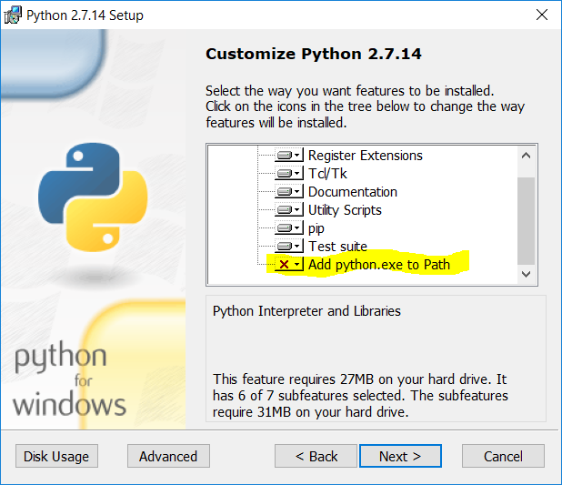
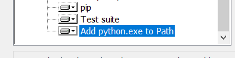
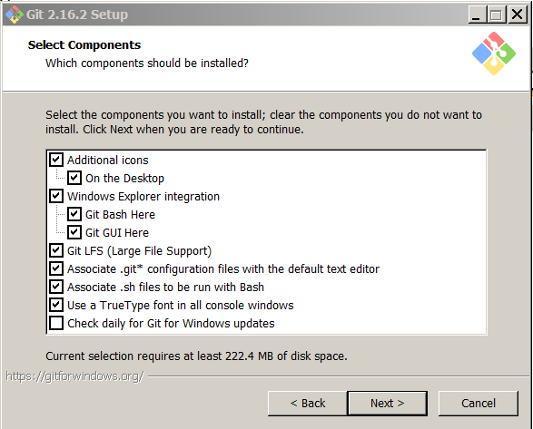
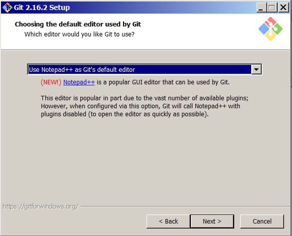
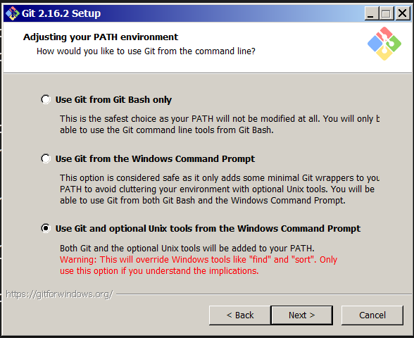

# Titanium Remote CLI CLients for Windows and Mac
__version 0.3, May 31, 2019 -- rmoorewrs@gmail.com __

The files in this repo can install the Titanium remote clients to your Windows Machine (see requirements). 

## Requirements for Windows:

1. Python 2.x must be installed on your windows machine and in the exe PATH (REQUIRED): 
> Note: use the latest python 2.x (2.7.16 as of this writing) -- python 3.x may work, but hasn't been tested
- Download the latest python 2.7.x for Windows from https://www.python.org/downloads/windows/
- Install and make sure to enable the `include python in your Windows path` option during installation
   - Note: this path option is at the bottom of the list and hidden from view.
   


Scroll down in the install customization dialog to find the path setting and click the small pulldown next to the red 'X' to include/enable the python path setting for Windows before clicking 'Next' to complete the installation:



After the install is complete, test it by opening a new Windows CMD shell (it may be necessary to log out and back in) and run both python and pip:
```
C:\> python --version
Python 2.7.16
C:\> pip --version
pip xx.xx from ...
```
If the path is set correctly,  you should see the python and pip versions displayed as above. If this fails, you'll need to fix the Windows PATH variable to include python.

2. Git for Windows must be installed on your machine and in the exe PATH (REQUIRED): 
- Download the latest git for Windows from https://git-scm.com/download/win

Run the git-for-windows installer and accept defaults for first dialog:



In the next dialog, select your default editor. The default is vim, but you can select another installed editor, such as Notepad++ or Visual Studio Code, etc.



In the third dialog, you should choose either of the last two options. Otherwise, git will not work from the standard Windows CMD shell. The last option is nice if you'd like to use Unix-style commands on Windows.



In the remaining dialogs, accept the defaults unless you know what you're doing and have a good reason to change the behavior. After installation completes, open a Windows CMD shell (logout/login might be required) and test git:
```
C:\> git version
git version 2.16.2.windows.1
```

3. You should have the latest copy of this repository, `tic-remote-clients-windows` on your Windows machine in a convenient location (i.e. short path), such as `C:\git`.
- either clone the repo, or do a `git pull` if you previously cloned it.
- uzip an archive if that's how you obtained the repo
- git for windows is required by the remote clients, whether you cloned the repo via git or unzipped the archive. 

>Note: there are many graphical git clients for Windows
>- See https://git-scm.com/downloads/guis for Windows GUI options
>    - Many of the options on the list are only free for personal use, so pay attention to the licensing.
>- TortoiseGit is free and lightweight. 
>- When git for Windows installs, a default gui client is installed but it seems extremely slow.

4. Download the openstack credentials file for your project (e.g. <projname>-openrc.sh) from Horizon, while logged into the project you want to work with:
```
Project->Compute->Access & Security->API Access (tab)->Download OpenStack RC File v3
```

## Remote Client Installation for Windows:
- open a windows CMD shell (*not* PowerShell) in the top level install directory
- run the `install-windows-rcli.bat` batch file and wait for it to complete

## Convert Openstack Credentials File to a Windows compatible script.
Both a Windows CMD shell Batch Files and Windows PowerShell PS1 script are created, depending on which shell you plan to use.
- copy your openstack credentials file from Horizon from prerequisite 4 into the top level install directory where you cloned/unzipped the repo
- convert your openstack credentials file to a CMD batch file or powershell script with the openrc2win.py utility (included). For example, if your openstack project is called `myproj` and the openstack project password for myproj is `mypass` you would do the following:
```
c:\git\tic-remote-clients-windows> python openrc2win.py --pass mypass  myproj-openrc.sh myproj-openrc
```
>Note: every time you open a new windows shell and want to use the remote CLI to work with 'myproj' you must first set the OpenStack remote credentials as shell environment variables by either running `myproj-openrc.bat` if you're using the Windows CMD shell, or `myproj-openrc.ps1` if you're using Windows PowerShell. If you receive authentication errors, or messages about providing --os-username,etc, you need to check that you ran the correct credentials script and that it has the correct values for your system and project.

- Open a CMD shell or PowerShelll and test the various clients with the `help` parameter
```
c:\path-to-openrc-bat-file\myproj-openrc.bat
C:\> cinder help
C:\> glance help
C:\> heat help
C:\> neutron help
C:\> nova help
C:\> openstack help
C:\> system help
```

Note on Windows PowerShell: many windows installations disble PowerShell scripts for security reasons. You can enable PowerShell scripts, by opening a PowerShell with administrator privilege and typing the following command: 
```
PS C:\> Set-ExecutionPolicy RemoteSigned
```
>Note: This may open your system to PowerShell-based attacks, so only do this if you know what you are doing and need to use PowerShell.

----

## Known Issues:
- no error checking in the installation scripts

